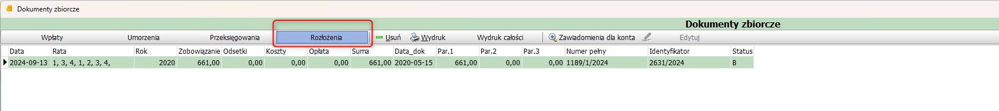
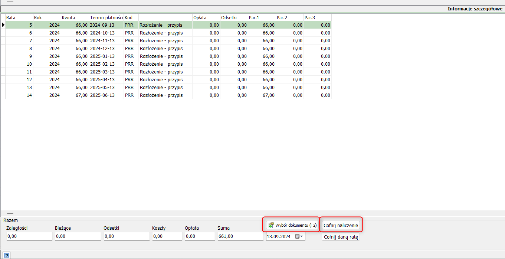

# Cofnięcie rozłożenia na raty

W celu cofnięcia rozłożenia na raty będąc na koncie należy w prawym górnym rogu przejść do zakładki "Dok.zbiorcze" a następnie "Rozłożenia"

Aby cofnać rozłożenie należy kliknąć przycisk "Wybierz dokument", a następnie wskazać dokument, oraz kliknać cofnij naliczenie. Rozłożenie na raty zostanie wycofane

