# Dodawanie deklaracji JPK VAT

---

## Domyślne parametry VAT
W celu ułatwienia pracy użytkownikom systemu możliwe jest wprowadzenie domyślnych danych, które przepisywane będą automatycznie w wybrane pola nowo tworzonych deklaracji. Miejscem, w którym owe dane możemy uzupełnić jest **Katalogi :material-arrow-right-bold: :fontawesome-solid-house-chimney:{.niebieski} Firmy** :material-arrow-right-bold: Zakładka *Dane deklaracji*. 

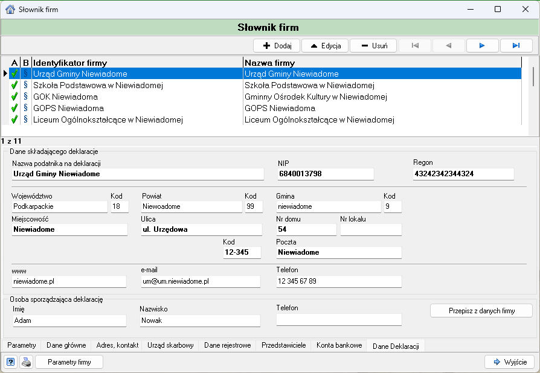

Po przejściu do wskazanego miejsca, wybieramy odpowiednią firmę, uzupełniamy wszystkie dane, sprawdzamy ich poprawność i zapisujemy przyciskiem . Od tego momentu odpowiednie pola na deklaracji będą wypełniane danymi wprowadzonymi w powyższym oknie.

## Generowanie deklaracji JPK VAT
Aby dodać deklarację VAT wybieramy zakładkę **Rejestry :material-arrow-right-bold:  Deklaracje Vat** lub szybciej wybierając ikonkę  w głównym oknie programu.

Następnie na gałęzi wybieramy odpowiedni okres, po czym wybieramy jeden z trybów tworzenia: deklaracja cząstkowa lub zbiorcza. 

- Pierwsza opcja dedykowana jest dla wszystkich jednostek składających deklarację częściową do organu nadrzędnego (zaokrąglenie części deklaracyjnej do 0,01). 
- Druga możliwość pozwala na wygenerowanie deklaracji JPK_V7 na podstawie deklaracji cząstkowych, a następnie przygotowanie wysyłki rozliczeniowej. 

|                                   | Do dyspozycji mamy następujące przyciski:        |
| :-------------------------------: | ------------------------------------------------ |
|   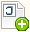   | Umożliwia dodanie deklaracji JPK VAT             |
|      | Pozwana na dodanie **starej** deklaracji VAT 7   |
|      | Służy do wprowadzenia dodatkowych informacji VAT |
|      | Edytuje zaznaczoną pozycje                       |
|   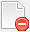   | Usuwa zaznaczoną pozycje                         |
|   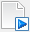   | Zatwierdza zaznaczoną pozycje                    |
|  | Generuje wydruk zaznaczonej pozycji              |
|      | Zapisuje zaznaczoną pozycje do pliku XML         |

### Deklaracja cząstkowa
Wybieramy ikonkę { width="20" }. Sprawdzamy czy wszystkie parametry są poprawne i wybieramy przycisk .
Po wybraniu odpowiedniego okresu rozliczeniowego i zatwierdzeniu wyboru system wyświetli formularz w którym widoczne są trzy główne sekcje: 
<code>Nagłówek</code>, <code>Deklaracja VAT-7 (22)</code> oraz <code>Ewidencja</code>. 

W Nagłówku wprowadzamy niezbędne dane identyfikujące: 

- cel złożenia (deklaracja, korekta); 
- okres rozliczeniowy; 
- zakres (część deklaracyjna i ewidencyjna) – domyślnie zaznaczone, w przypadku korekty należy zaznaczyć właściwe obszary; 
- podmiot, który sporządza (wymagany adres email)
- osobę sporządzającą – reprezentant podmiotu dla którego jest tworzony dokument. 

Aby naliczyć deklaracje z wprowadzonych wcześniej faktur wybieramy przycisk 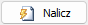. Program uruchomi procedurę naliczania danych deklaracyjnych oraz ewidencyjnych na podstawie wewnętrznych rejestrów zakupów i sprzedaży.
Jeżeli dane wygenerowane przez system nie są kompletne możemy samodzielnie wprowadzić brakujące dane, najczęściej dotyczy to sekcji 39 - rozliczenie podatku naliczonego - kwota nadwyżki z poprzedniej deklaracji.

Po każdej samodzielnej zmianie wartości w polach deklaracji należy wybrać przycisk 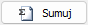 - jest to konieczne by przeliczyć pola wynikowe.

Zakładka <code>Ewidencja</code> zawiera dane ewidencyjne utworzone na podstawie wewnętrznych rejestrów: Rejestr sprzedaży Vat, Rejestr zakupów VAT, Rejestr korekt odliczeń VAT oraz Rejestru ulg za złe długi (ZD). W przypadku gdy podatnik posiada dodatkowe źródło powstawania danych, należy je dołączyć i zagregować z danymi wewnętrznymi. 

Jeżeli nasza deklaracja składa się nie tylko z wewnętrznych rejestrów zakupów i sprzedaży (z naszej jednostki), ale tak że z rejestrów dostarczonych z zewnętrznych źródeł np. System Rozliczeń komunalnych, Ewidencja mienia komunalnego - musimy zaczytać takie dodatkowe rejestry do naszej deklaracji.
W tym celu przechodzimy do zakładki <code>Załączniki JPK_V7M</code> i wybieramy przycisk  .
Następnie wyszukujemy nasz plik JPK_V7M z innej jednostki i wczytujemy go wybierając przycisk <code>Otwórz</code>.

Gdy dodany plik pojawi się na liście plików JPK_V7M przechodzimy do wcześniej utworzonej deklaracji i wybieramy przycisk 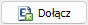.
Następnie z listy plików wybieramy interesujący nas plik JPK_V7M i wybieramy przycisk 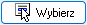. Następuje zaczytanie pliku z systemy zewnętrznego do ewidencji deklaracji. 
Po zaczytaniu pliku do ewidencji musimy nanieść zmienione dane na część deklaracyjną. W tym celu wybieramy przycisk . 

Po wprowadzeniu wszystkich danych do deklaracji tworzymy właściwy końcowy plik JPK V7M w zakładce <code>Załączniki JPK V7M</code> wybierając przycisk . Pojawi się plik JPK V7M z danymi z ewidencji.
By sprawdzić poprawność pliku JPK V7M ustawiamy się na wygenerowanym pliku, klikamy prawym przyciskiem myszy i wybieramy Sprawdź zgodność deklaracji z ewidencją. 

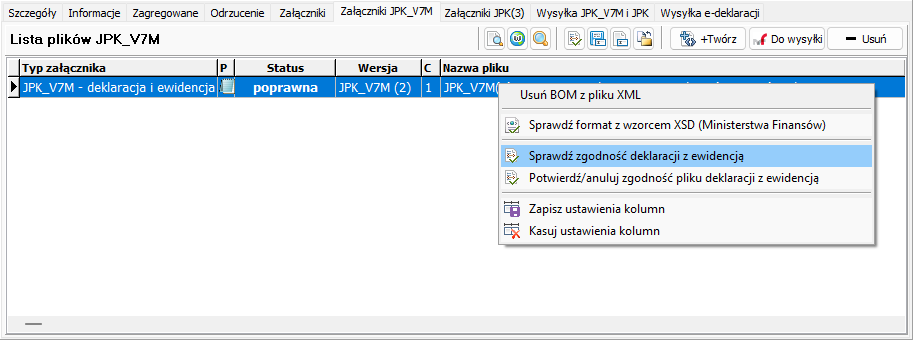

Dla cząstkowego pliku jpk nie jest konieczne sprawdzanie zgodności pliku ze schematem Ministerstwa Finansów. Jeśli cząstkowy plik JPK V7M nie jest zerowy taka kontrola wykaże błędy. Sprawdzamy wzorzec  xsd  tylko dla deklaracji zbiorczej.
Zawartość końcowego pliku JPK V7M można sprawdzić wybierając . Pozwala ona na dokładne zweryfikowanie informacji zawartej w plik.

Następnie zapisuję plik na dysk w wybranym miejscu skąd możemy go wczytać do wysyłki. W tym celu używamy przycisku  Zapisz plik jako...
Po zapisaniu pliku JPK V7M na dysku możemy go wczytać do programu wysyłki e-vat i przekazać do urzędu głównego.

### Deklaracja zbiorcza
Wybieramy ikonkę { width="20" }. Wybieramy przycisk <code>Centrala</code>, sprawdzamy czy wszystkie parametry są poprawne i wybieramy przycisk .

Zapisujemy deklarację przyciskiem 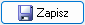. Następnie zaczytujemy części deklaracyjne jednostek podrzędnych wybierając przycisk 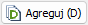.
Zaznaczamy wszystkie jednostki, które powinny zostać zaczytane do deklaracji.
