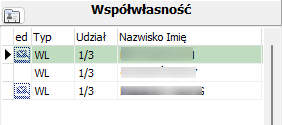

---
hide:
    - toc
---
# e-Doręczenia
`Rejestry ► e-Doręczenia`

Pod warunkiem prawidłowej konfiguracji usługi, w ramach programu Księgowości Podatkowej istnieje możliwość wykorzystania wysyłki za pomocą e-Doręczeń w procesie wystawiania upomnień.

Proces obsługi funkcjonalności obejmuje wyszukanie Adresów do Doręczeń Elektronicznych (ADE), przygotowanie obsługę wygenerowanych dokumentów oraz wysyłkę wiadomości w formie e-Doręczeń. Wykonywane operacje są analogiczne do pozostałymi programami podatkowymi.

Konto z wyszukaną skrzynką e-doręczeń można rozpoznać po ikonie koperty , która wyświetla się przy koncie oraz przy współwłaścicielu na liście współwłasności.

 

Dodatkowo w dolnej części panelu współwłasności oraz na koncie indywidualnym wyświetla się pole z adresem skrzynki.
