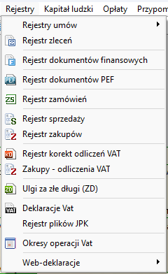
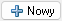
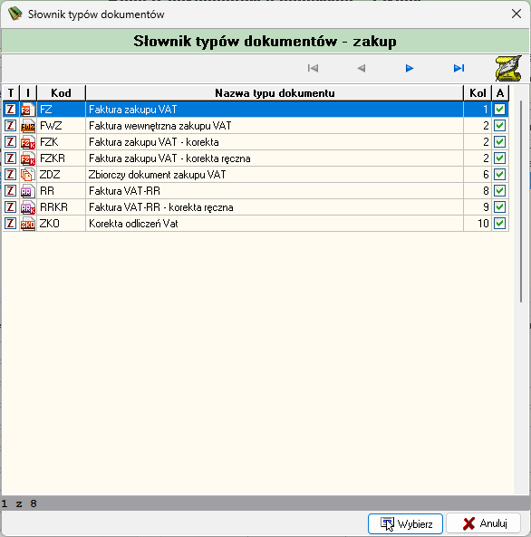
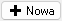
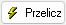
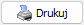
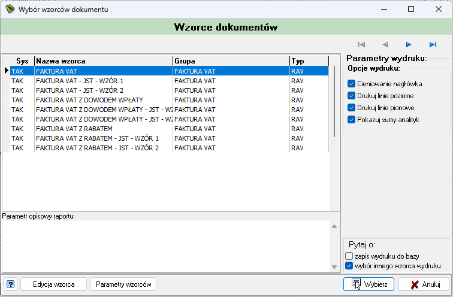
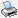
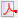

# Wprowadzanie faktur w rejestrze zakupów

---
Aby wprowadzić fakturę zakupową wybieramy zakładkę **Rejestry** :material-arrow-right-bold:  **Rejestr zakupów** lub szybciej wybierając ikonkę  w głównym oknie programu.

Następnie wybieramy przycisk  i wybieramy typ dokumentu z listy po czym wybieramy przycisk .

W nowym oknie wprowadzamy **nazwę** oraz **opis** faktury. (Jeśli posiadamy **nr źródłowy** to wprowadzamy go w odpowiednim polu).

Wprowadzamy **odpowiednie daty** do dokumentu:

- Data dla VAT - decyduje do jakiego dekretu JPK zostanie przypisana dana faktura.
- Data wpisania
- Data wystawienia
- Data otrzymania
- Data sprzedaży
- Termin płatności

Następnie wprowadzamy **kontrahenta**. Jeśli kontrahent posiada przypisane konto z planu kont to wybieramy go wybierając ikonkę ; Jeśli kontrahent nie posiada konta to wybieramy go z kartoteki kontrahentów  i wybieramy ikonkę , aby wygenerować konto rozrachunkowe.
Wybieramy **rodzaj** i **rejestr VAT**. Wybieramy czy **naliczenie VAT** będzie od kwoty **netto** czy **brutto** oraz wybieramy **odliczenie VAT**.
Następnie wybieramy przycisk , żeby dodać kwoty faktury. 

Wpisujemy kwotę przy odpowiednich stawkach VAT i wybieramy przycisk . Jeśli wybraliśmy odliczenie procentowe wybieramy przycisk <code>%</code>. Jeśli przeliczona kwota jest inna niż kwota, która powinna być, to możemy ją zmienić ręcznie zaznaczając opcję **Bez kontroli wartości** i poprawiając kwotę. Wybieramy przycisk .

Możemy podejrzeć wprowadzoną fakturę na wydruku wybierając przycisk  i wybierając odpowiedni wzorzec z listy.

Fakturę możemy wydrukować lub zapisać wybierając ikonkę  lub  w lewym górnym rogu ekranu.

