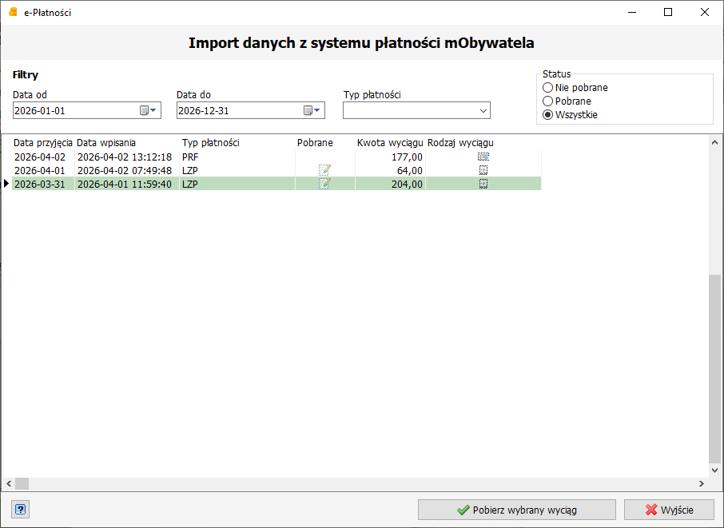
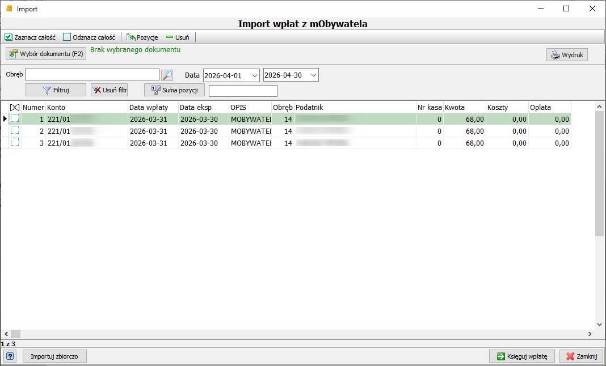

`Import -> Import wpłat z mObywatela`

Płatności dokonywane za pośrednictwem portalu mObywatel pojawią się automatycznie dzięki działającemu w lokalnej jednostce serwisowi.

Pliki do zaczytania pojawią się w oknie `Importu danych z systemu płatności z mObywatela`. Dwukrotne kliknięcie powoduje otwarcie podglądu zaczytywanego pliku. Płatności są odizolowane względem kontekstów, tzn. że widoczne dane są dostępne tylko dla aktualnego kontekstu (widoczne będą tylko wpłaty dokonane na dany kontekst). Każdy wyciąg posiada typ płatności, rodzaj oraz całkowitą kwotę wyciągu. Dodatkowo pozycje już pobrane zostały oznaczone ikoną. Przed pobraniem oznaczonego wyciągu pojawi się pytanie czy chcemy ponownie pobrać wyciąg. 

Przycisk `Pobierz wybrany wyciąg` przenosi wpłaty do bufora księgowości podatkowej, skąd można zaksięgować wpłatę na odpowiednie konto. Po pobraniu wyciągu automatycznie pojawią się zaimportowane pozycje wpłat. Przycisk `Importuj zbiorczo` księguję zaznaczone wpłaty zgodnie z wyznaczonym przez podatnika zamiarem (np. podatnik zapłacił ratę 3 - wpłata zostanie zaksięgowana na tą ratę). Opcja `Księguj wpłatę` pozwala na zaksięgowanie tylko jednej (podświetlonej) pozycji. Przy czym umożliwia księgowanie na inne raty niż zadeklarowane. 
 

<strong>Zalecamy korzystanie z opcji Importu zbiorczego</strong>

Następnie postępujemy analogicznie jak w przypadku zwykłego [księgowania wpłaty](../operacje_ksiegowe/ksiegowanie_wplat.md).

#### Typ Płatności

Oznaczenie o typie zobowiązania, na które została dokonana wpłata

- NOF - Podatek od nieruchomości
- PRF - Podatek rolny
- PLF - Podatek leśny
- LZP - Łączne zobowiązanie pieniężne
- ZOK - Zagospodarowanie odpadami komunalnymi
- REMINDER - Upomnienie

#### Rodzaj wyciągu

Oznaczenie jakim rodzajem płatności bezgotówkowej została uiszczona wpłata

-  - BLIK
-  - płatność kartą