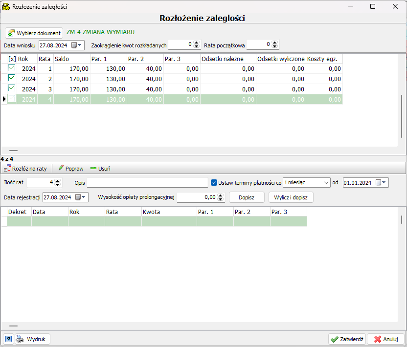
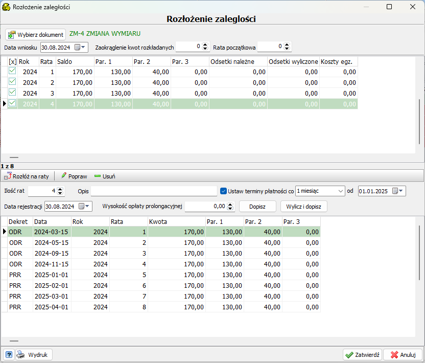

# Rozłożenie na raty

---

W celu rozłożenia na raty należy wejść na konto podatnika, którego rozłożenie ma dotyczyć.

Następnie z panelu przycisków wybieramy opcję&emsp;&emsp;

Następnie na otwierającym się okienku zaznaczyć wszystkie raty które mają być rozłożone 

Pod dostępnymi ratami jest możliwość wybrania ilości rat na które zobowiązania mają być rozłożone. Terminy płatności są do wyboru, rozpoczynając od daty pierwszej płatności, oraz systematyczności kolejnych dat.

Po kliknięciu przycisku&emsp;&emsp; obecne raty zostaną odpisane (dekret ODR), a dopisana zostanie należność(PRR) z odsetkami(NOP, jesli będą wymagane) z ustawionymi terminami

W przypadku gdy wartości na poszczególnych ratach mają mieć niestandardowe kwoty rozłożenia powstałe dekrety można edytować za pomocą przycisku "Popraw" ustawiając się na konkretnej pozycji. Po sprawdzeniu poprawności rat klikając "Zatwierdź"
powstałe dekrety zostaną dodane do konta. 