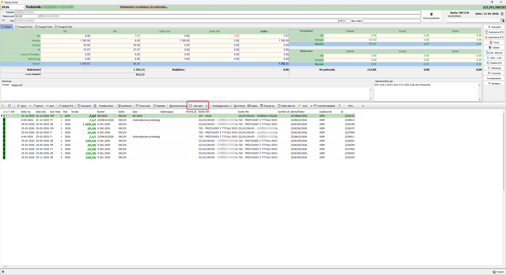
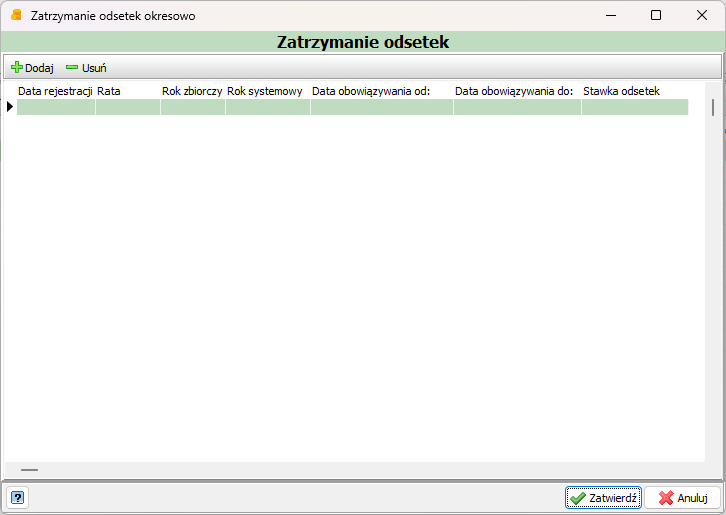
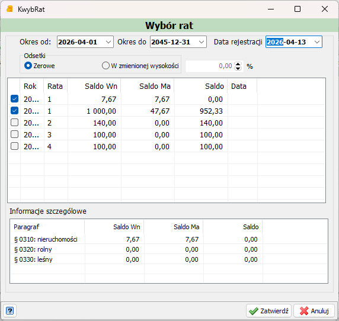

`Konto indywidualne -> Ods zatrz`

Z poziomu konta indywidualnego istnieje możliwość zatrzymania odsetek na poszczególnych ratach na dany okres.

Wyświetli się okno `Zatrzymanie odsetek`, z którego poziomu możemy dodać nowe zatrzymanie. 

Klikając `Dodaj` w lewym górnym rogu pojawi się okno `Wybór rat`. Kolejno od góry wybieramy: 

- `Okres od` - datę rozpoczęcia zatrzymania, 
- `Okres do` - datę zakończenia (jeśli to jest zatrzymanie dożywotnie, najlepiej ustawić rok na 20 lat do przodu),
- `Data rejestracji` - data, od której zatrzymanie ma obowiązywać,
- `Odsetki` - Zerowe lub W zmienionej wartości i ustalamy ich wysokość

Na koniec wybieramy raty objęte zatrzymaniem.

Po poprawnym wprowadzeniu danych zatwierdzamy. Odsetki przeliczą się automatycznie względem wybranej daty obliczeniowej.

 