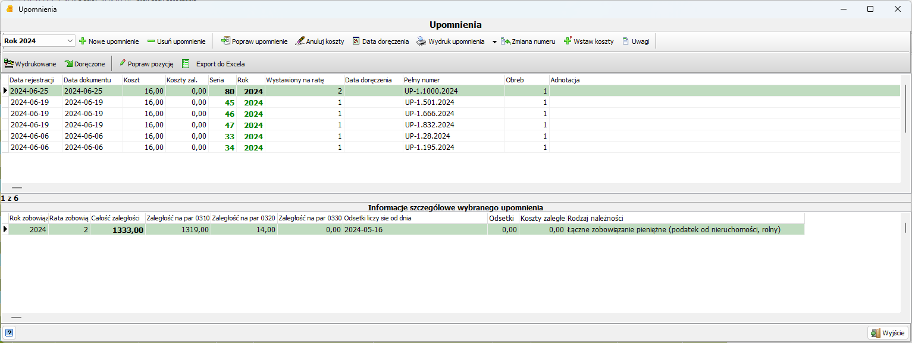

Z panelu funkcyjnego dostępnego bezpośrednio z konta indywidualnego wybieramy opcję . Zostanie wywołane wówczas  okno w którym znajdują się informacje o wystawionych dotychczasowo dokumentach. W górnej części znajduje się 
pasek funkcyjny oraz lista informacji nagłówkowych, dolny panel zawiera dane szczegółowe wygenerowane na podstawie zadanych warunków. Są to informacje o numerach rat, kwotach analitycznych (klasyfikacja budżetowa) z jakich składa się zaległość, typie zobowiązania oraz terminie naliczania odsetek.

## Tworzenie upomnienia

Proces generowania nowego upomnienia rozpoczyna się od wybrania z paska funkcyjnego opcji `Nowe upomnienie`. Wyświetli się okno wskazania podatnika, którego dotyczyć będzie upomnienie, a następnie okno nowego upomnienia.

W pierwszej kolejności należy wskazać dokument w którym znajdą się dekrety przypisujące należne koszty upomnienia . Druga część formularza zawiera informacje – okres wg którego będzie badany  stan zaległości. **Data rejestracji**  i **Data dokumentu** to daty wprowadzenia do systemu oraz termin wymagalności poszczególnych rat, **Zaległość na dzień** wskazuje datę graniczną, dla której będzie badany stan zaległości podatkowych. Znacznik **Pobierz odsetki dla całości** określa sposób wykazywania odsetek należnych: oddzielnie dla każdej raty (domyślnie), razem gdy pole jest zaznaczone. **Pobierz koszty zaległe dla wszystkich rat** pozwala na pobranie kosztów zaległych.

`Wybór sposobu wykazywania odsetek określa algorytm wg którego wyliczana jest kwota graniczna oraz zaokrąglenie na każdej racie lub zbiorczo dla wskazanych.`

W trzeciej części znajdują się raty (w rozbiciu na kwoty analityczne), które stanowią zaległość podatkową. Zadaniem użytkownika  jest wskazanie, które z nich mają się znaleźć na dokumencie upomnienia (zaznaczenie pola chceckbox). Ostatni element wyboru to wskazanie serii upomnień - może ona oznaczać obręb dla którego są generowane dokumenty lub kolejną „paczkę” dokumentów w obrębie roku. Pole **Do raty** określa ratę do której zostaną przypisane dokumenty kosztów upomnienia.  
Checkbox `Wystaw dla współwłaścicieli` powoduje wystawienie upomnień na wszystkich współwłaścicieli. Możliwe jest również `Pominięcie rat objętych upomnieniem / tytułem`.

Po określeniu wszystkich parametrów zawartych w formularzu oraz zatwierdzeniu tych zmian program wygeneruje odpowiednie wpisy do kartoteki Upomnienia. Tak przygotowane dane można wydrukować poprzez wybór z paska narzędziowego opcji `Wydruk upomnienia` - po wskazaniu szablonu wydruk trafi na drukarkę, lub w przypadku posiadania przez kontrahenta adresu e-doręczeń - do Rejestru e-doręczeń.

System umożliwia usunięcie wybranego wpisu – w przypadku gdy nastąpi taka potrzeba z paska funkcyjnego należy wybrać przycisk `Usuń upomnienie`. Usunięcie  wygenerowanych informacji może wprowadzić nieciągłość numeracji upomnień, w przypadku gdy nie jest to ostatnio wygenerowany dokument. Usunięcie dokumentu upomnienia z kartoteki powoduje również anulowanie przypisanych do konta kosztów administracyjnych.

W przypadku gdy nie chcemy usuwać upomnienia, a jedynie anulować koszty można użyć jednej z dwóch funkcji służących do modyfikacji zapisów: `Popraw upomnienie` pozwala na modyfikację kwoty kosztów (w wyświetlonym oknie należy wprowadzić odpowiedni wpis i potwierdzić zmianę), natomiast `Anuluj koszty` zmienia wartość kwoty na 0,00.